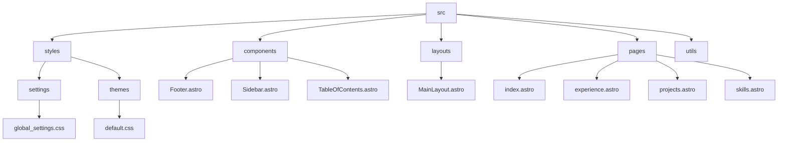
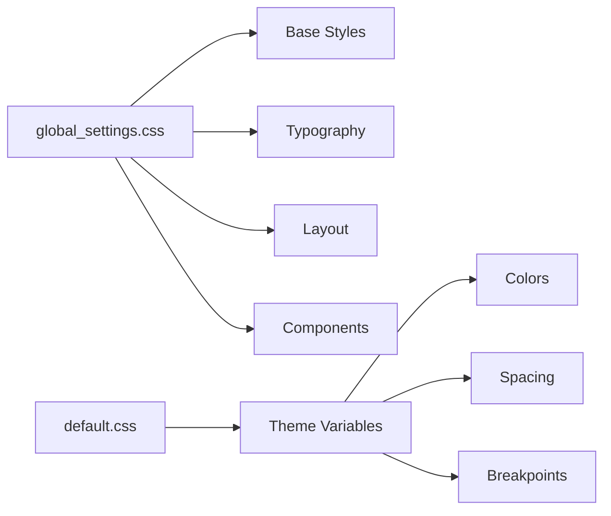
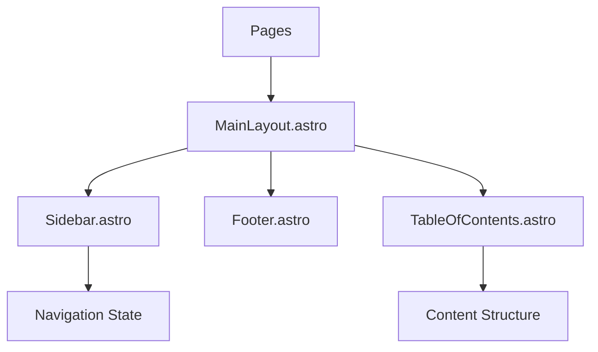

# Portfolio Website

A modern, responsive portfolio website built with Astro and Tailwind CSS.

## 🚀 Project Structure



## 📁 File Organization

### Core Components

- `MainLayout.astro`: The primary layout component that handles:
  - Navigation bar with date/time display and cat animation
  - Sidebar integration
  - Content sections
  - Responsive design
  - Global state management

### Styling Architecture

The project uses a centralized styling approach:



#### Global Style Control

All styles are managed through:
- `src/styles/global_settings.css`: Core styles and global variables
- `src/styles/themes/default.css`: Theme-specific variables

Key style controls:
- Font: Inter (primary), system fonts (fallback)
- Colors: Black (text), gray-400 (subheadings)
- Font sizes: 0.8em (lists, paragraphs, navigation items)
- Layout: Flexbox and Grid systems
- Responsive breakpoints

### Component Communication



### File Relationships

- `.astro` vs `.jsx` files:
  - `.astro`: Server-side rendered components with static optimization
  - `.jsx`: Client-side interactive components (removed unused ones)
  - Only kept necessary implementations to reduce duplication

### CSS Conflict Prevention

To prevent conflicts between global styles and HTML page styles:
- HTML content is wrapped in `[data-html-content]` selector
- Custom styles in HTML pages take precedence
- Global styles provide fallback styling

## 🛠 Development

```bash
# Install dependencies
npm install

# Start development server
npm run dev

# Build for production
npm run build
```

## 🎨 Customization

### Adding New Pages

1. Create new `.astro` file in `src/pages`
2. Import MainLayout
3. Add content
4. Update navigation if needed

### Modifying Styles

1. Update variables in `src/styles/themes/default.css`
2. Modify global styles in `src/styles/global_settings.css`
3. Add page-specific styles in HTML content

## 📱 Responsive Design

- Mobile-first approach
- Breakpoints:
  - sm: 640px
  - md: 768px
  - lg: 1024px
  - xl: 1280px

## 🔒 Best Practices

- Semantic HTML
- Accessible components
- Performance optimized
- Clean code structure
- Consistent naming conventions